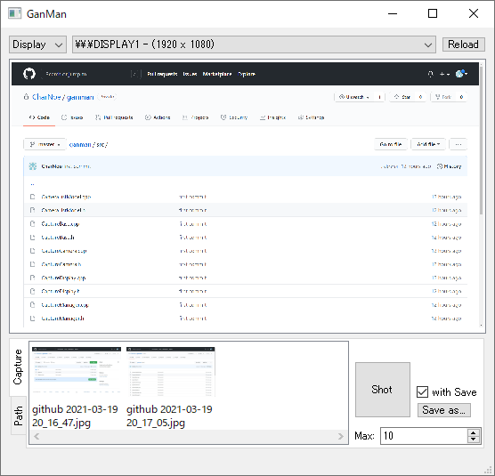

# Ganman
Simple and multi-platform screen/camera capture

## Build required
* [Qt5](https://www.qt.io/)

## Features
* Capture following devices
    * Display
    * Web camera
* Manage capture images
    * Open image by default application
    * Delete images

